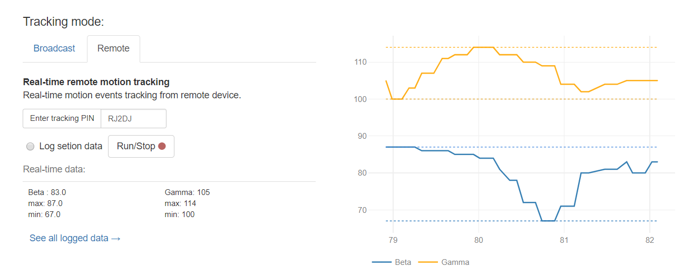

# sunrise
Sunrise is a pure javascript real-time motion event monitoring and broadcasting system for gyroscope equipped devices. 

To get started:
* Broadcasting: use any gyroscope equipped device (smartphone/tablet) and navigate to [jadfegh.com/sun](http://jadfegh.com/sun/). Click on __Generate connection PIN__ and start the broadcast.
* Monitoring: on a separate device, navigate to the same address. Select tab __Remote__, input the `PIN` assigned to your broadcasting device, and start the capture.